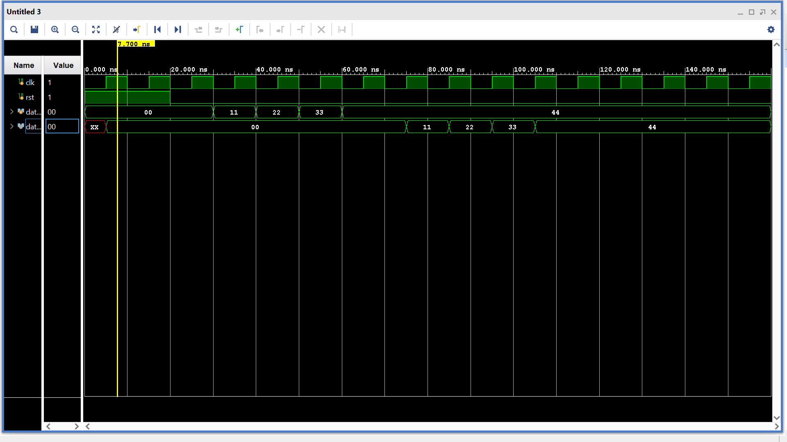

# 8x8 FIFO Memory Design using Verilog HDL

## Overview

This project implements an **8x8 FIFO (First-In First-Out) Memory** using **Verilog HDL**.

FIFO is a temporary storage memory in which:

> **The first data written into memory is the first data read out.**

This design includes:

- **Producer Module (`mod_a`)** → writes data into FIFO  
- **8x8 FIFO Memory (`fifo_8_8`)** → stores data  
- **Consumer Module (`mod_b`)** → reads data from FIFO  
- **Top Module (`top_fifo`)** → connects all modules together

The design is verified using a **Verilog testbench** and simulated in **Vivado**.

---

## Features

- 8-bit data width
- FIFO depth = 8
- Separate write and read control
- Full and Empty status detection
- Modular Verilog design
- Testbench with waveform verification

---

## FIFO Working Principle

FIFO follows the **queue concept**:

```text
First In → First Out
```

Example:

```text
Input Order:
11 → 22 → 33 → 44

Output Order:
11 → 22 → 33 → 44
```

The first data stored is the first data retrieved.

---

## Module Description

### 1. `mod_a` (Producer Module)

This module writes incoming data into FIFO.

#### Inputs

| Signal | Size | Description |
|---------|------|-------------|
| `clk` | 1-bit | Clock signal |
| `rst` | 1-bit | Reset signal |
| `full` | 1-bit | FIFO full indicator |
| `data_in` | 8-bit | Input data |

#### Outputs

| Signal | Size | Description |
|---------|------|-------------|
| `data_out` | 8-bit | Data sent to FIFO |
| `wr_en` | 1-bit | Write enable signal |

Working:

- If FIFO is **not full**, data is written.
- If FIFO becomes **full**, writing stops.

---

### 2. `fifo_8_8` (FIFO Memory)

This module stores data temporarily.

#### Inputs

| Signal | Size | Description |
|---------|------|-------------|
| `clk` | 1-bit | Clock signal |
| `rst` | 1-bit | Reset |
| `wr_en` | 1-bit | Write enable |
| `rd_en` | 1-bit | Read enable |
| `data_in` | 8-bit | Input data |

#### Outputs

| Signal | Size | Description |
|---------|------|-------------|
| `data_out` | 8-bit | Read data |
| `full` | 1-bit | FIFO full |
| `empty` | 1-bit | FIFO empty |

FIFO uses:

- **Write Pointer (`wr_ptr`)**
- **Read Pointer (`rd_ptr`)**

for storing and retrieving data.

---

### 3. `mod_b` (Consumer Module)

This module reads data from FIFO.

#### Inputs

| Signal | Size | Description |
|---------|------|-------------|
| `clk` | 1-bit | Clock signal |
| `rst` | 1-bit | Reset |
| `empty` | 1-bit | FIFO empty flag |
| `data_in` | 8-bit | Data from FIFO |

#### Outputs

| Signal | Size | Description |
|---------|------|-------------|
| `data_out` | 8-bit | Final output |
| `rd_en` | 1-bit | Read enable |

Working:

- If FIFO is **not empty**, read operation occurs.
- Data is transferred to output.

---

### 4. `top_fifo`

Top module connects:

```text
mod_a → FIFO → mod_b
```

Data Flow:

```text
Input Data
     ↓
   mod_a
     ↓
  FIFO Memory
     ↓
   mod_b
     ↓
 Output Data
```

---

## Simulation Waveform



---

##schematic diagram


## Applications of FIFO

- UART Communication
- Buffer Memory
- Data Streaming
- Clock Domain Crossing
- Processor Pipelines

---

## Author

**Rohit Baskey**  
Verilog HDL Project — FIFO Memory Design
